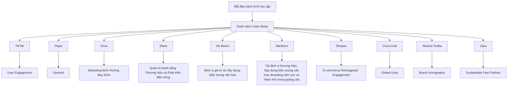

# 🎙️ Daily Marketing Cases & Podcast (WOW Edition)

Hệ thống tự động nghiên cứu, phân tích chuyên sâu các Case Study Marketing kinh điển và hiện đại dưới dạng **Podcast Tiếng Việt** và **Bài viết chuẩn Cuộc thi Giải Case**. Hệ thống tự động gửi thông báo qua Email vào lúc 12h00 trưa hàng ngày và đồng bộ lên giao diện Web App Premium trên GitHub Pages.

---

## 🌀 Các Tính năng Đặc biệt

1. **🔄 Tỷ lệ Học tập 2:1 (Quá khứ & Hiện tại):**
   - 2 Case Quá khứ: Đọc và học các nguyên lý marketing cốt lõi từ các thương hiệu lớn trong lịch sử.
   - 1 Case Hiện tại: Phân tích các thách thức marketing thời sự nóng hổi của các doanh nghiệp lớn ở thời điểm hiện tại (2025/2026).
2. **🏆 Bài giải Chuẩn Cuộc thi (Case Competition Style):**
   - Phân tích chi tiết Thấu hiểu khách hàng (Target Insight), Ý tưởng lớn (Big Idea) và Kế hoạch truyền thông tích hợp (IMC Plan) 3 giai đoạn.
3. **🎙️ Podcast Tiếng Việt Chuyên sâu (7-15 phút):**
   - Bản tin âm thanh phân tích sinh động bằng giọng đọc AI tự nhiên, giúp anh "nghe và thấm" mọi lúc mọi nơi.
4. **🔒 Web App Premium bảo mật (GitHub Pages):**
   - Giao diện Dark Mode, tích hợp trình phát Audio và bộ lọc thông minh, bảo mật bằng mật khẩu cá nhân.

---

## 🕸️ Bản đồ Liên kết Kiến thức (Knowledge Graph)

Dưới đây là sơ đồ liên kết các case study đã học (tự động cập nhật):

---

## 📈 Nhật ký Học tập (Study Log)

| Số | Ngày học | Thương hiệu | Phân loại | Chủ đề cốt lõi | Chi tiết |
| :--- | :--- | :--- | :--- | :--- | :--- |
| #15 | 2026-06-22 | **Zara** | 🔴 Hiện tại | `Sustainable Fast Fashion & Hyper-Personalization` | [Xem chi tiết](cases/markdown/2026-06-22-zara.md) |
| #14 | 2026-06-21 | **Absolut Vodka** | 🔵 Quá khứ | `Brand Iconography & Consistent Creative Advertising` | [Xem chi tiết](cases/markdown/2026-06-21-absolut-vodka.md) |
| #13 | 2026-06-19 | **Coca-Cola** | 🔵 Quá khứ | `Global Unity & Emotional Branding` | [Xem chi tiết](cases/markdown/2026-06-19-coca-cola.md) |
| #12 | 2026-06-18 | **Shopee** | 🔴 Hiện tại | `E-commerce Reimagined: Engagement & Loyalty in the Short-Form Video Era` | [Xem chi tiết](cases/markdown/2026-06-18-shopee.md) |
| #11 | 2026-06-17 | **Marlboro** | 🔵 Quá khứ | `Tái định vị thương hiệu, Xây dựng biểu tượng văn hóa, Branding cảm xúc và Nam tính trong quảng cáo` | [Xem chi tiết](cases/markdown/2026-06-17-marlboro.md) |
| #10 | 2026-06-16 | **De Beers** | 🔵 Quá khứ | `Định vị giá trị và Xây dựng biểu tượng văn hóa` | [Xem chi tiết](cases/markdown/2026-06-16-de-beers.md) |
| #9 | 2026-06-15 | **Shein** | 🔴 Hiện tại | `Quản trị Danh tiếng Thương hiệu và Phát triển Bền vững` | [Xem chi tiết](cases/markdown/2026-06-15-shein.md) |
| #8 | 2026-06-14 | **Dove** | 🔵 Quá khứ | `Marketing Định Hướng Mục Đích & Sức Mạnh của Thông Điệp Chân Thật` | [Xem chi tiết](cases/markdown/2026-06-14-dove.md) |
| #7 | 2026-06-13 | **Pepsi** | 🔵 Quá khứ | `General` | [Xem chi tiết](cases/markdown/2026-06-13-pepsi.md) |
| #6 | 2026-06-12 | **TikTok** | 🔴 Hiện tại | `User Engagement & Platform Diversification` | [Xem chi tiết](cases/markdown/2026-06-12-tiktok.md) |
| #5 | 2026-06-11 | **Volkswagen** | 🔵 Quá khứ | `Contrarian Marketing & Authentic Positioning` | [Xem chi tiết](cases/markdown/2026-06-11-volkswagen.md) |
| #4 | 2026-06-10 | **Starbucks** | 🔵 Quá khứ | `Marketing Trải Nghiệm & Định Vị Không Gian Cộng Đồng` | [Xem chi tiết](cases/markdown/2026-06-10-starbucks.md) |
| #3 | 2026-06-10 | **Netflix** | 🔴 Hiện tại | `Tái Định Vị Nền Tảng & Chiến Lược Nội Dung Cho Thế Hệ Z/Alpha` | [Xem chi tiết](cases/markdown/2026-06-10-netflix.md) |
| #2 | 2026-06-08 | **Nike** | 🔵 Quá khứ | `Emotional Branding, Market Re-positioning & Cultural Relevance` | [Xem chi tiết](cases/markdown/2026-06-08-nike.md) |
| #1 | 2026-06-08 | **Apple** | 🔵 Quá khứ | `Brand Rebirth, Emotional Branding, Value-Based Marketing, Community Building` | [Xem chi tiết](cases/markdown/2026-06-08-apple.md) |

---

## 🛠️ Hướng dẫn cài đặt và thiết lập dự án

*Mở file hướng dẫn thiết lập của dự án để cấu hình GitHub Secrets.*
